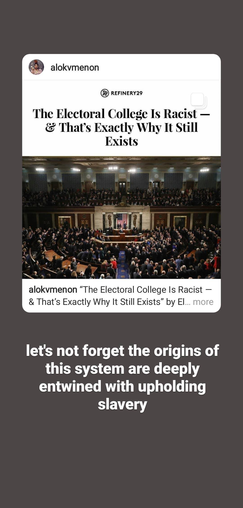

# PERSONAL CHANGE CHALLENGE LOG

to document my progress through my personal change challenge

## table of contents
[18/10/20](#sun-181020)  
[19/10/20](#mon-191020)  
* [note](#note)  

[21/10/20](#wed-211020)  
[23/10/20](#fri-231020)  
[04/11/20](#wed-041120)  
[05/11/20](#thurs-051120)  
[06/11/20](#fri-061120)

## fri 06/11/20
today, i posted on my story twice in an effort to make my smaller-scale goals of amplifying messages i find important. each only took a few minutes each but here are the screenshots for them. one amplified another instagram post that i found to be very informative about the true origins of the electoral college. the other amplified a tweet on my twitter feed that highlighted the efforts of stacey abrams in georgia and also commented on the extraordinary choice she made to invest in her community after a loss instead of running after more fame through a presidential run.  

## thurs 05/11/20
i'm writing this post because i didn't finish my post from yesterday. basically, i had intended to post about the misinformation reading before the election happened just in case it would help people i know with their own families who may be trump supporters. i wanted to include explanations amongst highlighted sections that i found important but in the end, i didn't get around to it before the election happened (unfortunately). despite this, i still want to post about this reading on the weekend. i think i will highlight the fact the even if biden wins, the fight is still not over and that there are still plenty of people who we need to reach who live in this alternate reality as highlighted in the misinformation reading.

i also wanted to reflect on the fact that even the small posts i did make about voting made me nervous to post. i realize that absolutely no one judged me (probably) because the posts were about staying in line and what to prepare for in case you were denied a ballot which are relatively uncontroversial things but i still had a moment of stress where i almost did not post because i thought it was useless or overdone information. even if posting about staying in line and other voting information was a repeated message throughout my own feed, that doesn't mean it's fully useless to continue posting it and i myself sometimes find that once a specific post has been posted enough times, i spend the time to read it more thoroughly (especially compared to posts that i see only once and are too long to retain my attention). also, this reminds me of one of the tips that we discussed last week in esd150 which discussed how communication is almost always done at a tenth of the rate it should be done to be fully effective so even if it seems like content is being repeated, that repetition is in fact enhancing the message even if it seems over the top.

finally, i've decided i need to, in general, put some more infrequent, smaller type goals for posting and amplifying messages on social media. specifically, i've decided that i need to amplify at least one message every other day. this message can be something someone else posted or just something i resonated with but doesn't need to have as much thought. i will do postings of readings with more thought and intention behind the posts on top of these but those i will perhaps do once a week as opposed to every couple days. for my own reference i'm listing some ideas for this longer form posts below:
* misinformation reading posts and thoughts
* posting about casteism in india based on my own ramayana readings
* posting about development as freedom as i go through the book
* finish posting thoughts from angela davis' 'are prisons obsolete?' that i read over summer
* post thoughts from intercommunalism by huey newton
* **add more readings to this list**

## wed 04/11/20
i had intended to write much earlier than now about different thoughts i had especially along these lines of changing my social media behavior but have been feeling intensely stressed about the american election and as a result, never actually stuck to the original plan of being consistent. i have plans to be more consistent now but we shall see how well i can keep up with my plans. i feel a little sad about not having it together on social media because i had intended to post more often around election time but became overwhelmed just by the stress of outcome. i did post a few times on my instagram story about voting line procedures and how to ensure your vote is counted but i had more extravagant plans. i really loved the misinformation reading and was planning on posting about that.

## fri 23/10/20
i received notice that i was accepted into cambridge hub's engage for change program.

## wed 21/10/20
i had an interview for cambridge hub's engage for change program. it may be a good program to contribute to this personal change challenge as well.

## mon 19/10/20
i've been thinking about what type of personal change i want to interrogate and came up with a few different ideas which have different depths of personal involvement. some of the options i had thought of are more community-oriented and require less personal reflection (in my own estimation) because i have large amounts of experience in those routes but others are much more personal and will require internal work to become comfortable with. just to start out with, here are the options i was thinking about:
* working with cambridge hub on their carbon literacy project
* working with newnham's environmental justice society specifically towards newnham college's divestment and possibly to better bame involvement within the organization which is currently all white
* interrogating my own relationship with social media especially in how it can be used as a tool to educate those around you
* pushing  myself to choreograph more frequently

i believe it's important for me to consider the true transformative value of each of the options i stated above because i would like to use this opportunity to actually challenge myself and not simply expand on a skillset i already have a good deal of experience with. with that in mind, i'll go into more detail into what benefits each of the options has for me (as i see them now, i obviously can't account for unexpected co-benefits that may come out of each experience.)

before hearing about the details of the personal change challenge as an assignment, i had already thought about working with the cambridge hub on this project. during quarantine, i did some research into how to get more involved in the community of cambridge as a whole and cambridge hub came up quickly in these searches. in undergrad, i had worked on similar types of project in the community and on campus so it felt natural to want to continue to have those experiences here at cambridge but it was also quite quickly apparent that the skills that would go into cambridge hub were very similar to ones i had already developed as a sustainability leader in my undergraduate years in planning large projects involving the management of large numbers of volunteers. despite that, it is still interesting work to me and i am sure there are still plenty of things for me to learn in the subject of carbon literacy. only last week, i heard of the concept of carbon rationing which hadn't even occurred to me until i went to a cambridge community talk about it so i'm sure i will learn a lot through even this experience. some of the downsides of this option include the fact that i had already intended to do this work and i'm not sure the impetus of the personal change challenge will force me to want to pursue it more in depth. it would be nice if the challenge itself pushed me to do something out of my ordinary anyways if that makes sense.

similar to cambridge hub, i had already reached out to newnham college's environmental justice society early on when i was looking at cambridge societies during quarantine. their strategy is more focused on inviting speakers and raising awareness of environmental issues through speakers, screenings and other similar events. recently, they also produced a 10-point guide to climate change booklet that was distributed to all students at newnham and also posted online to act as a primer for those who were unfamiliar with the terms and true extent of climate change and its impacts. when i joined one of their meetings, i noticed i was the only bame woman in the committee and mentioned how important the intersectional component of environmental justice was as well. the committee very quickly expressed that it was an avenue they were interested in exploring so it's something that i may pursue with that society, how to make it more inclusive to intersectional issues. again, this is an endeavor i have some experience with from my undergraduate years so i'm not sure it will push me internally too much.

out of the four ideas that i listed, the concept of interrogating my relationship with social media is probably the one that makes me most uncomfortable. the motivation for this idea comes from the several friends i am connected to both on instagram and twitter where they use their platforms to spread awareness and knowledge about issues that are left out of mainstream media sources and offer new perspectives i had no idea existed. i personally have learned so much just from what active people on my social media platforms have posted whether that be through book lists they have posted or opinions from their own personal lives that i would never have guessed. i admire their bravery in posting about sometimes such personal viewpoints on social media but i have always had a much more self-conscious relationship with social media and what i post on there. i overthink whether a post i may want to make even matters to those who follow me and some months ago i actually started a _finsta_ (a.k.a. _fake_ instagram except that you post your actual feelings there as opposed to your main instagram account) as a way to post more personal things to the much smaller group of friends i actually kept in regular contact with. my main instagram account has 589 followers though and i realize that i really don't know many of the people who follow me very well but that is in fact an avenue to having an influence in someone's life that may be entirely unexpected and unanticipated. i did one time over summer test my courage by posting a series of stories about a text by angela davis i resonated a lot with and even that one small series of posts received responses from people that i had not talked to in years and yet they thanked me for letting them know of the existence of such reading material. it was one person but there must've been a number of people who absorbed the content of those posts and did not reach out because they felt distant from me (which is fine of course). it just made me aware of how your true reach especially on social media is very chaotic and can have small impacts in the society around you that can blossom in unanticipated ways. despite doing it once over summer, the act of posting stories was still quite socially exhausting for me and i didn't have the will power to do a full post like that again despite reading plenty of other very interesting and brilliant texts that i felt were so relevant to understanding our society as it stands now. besides posting about social justice initiatives and my own self-education, i am an indian classical dancer and increasingly in this world, social media has become and indispensable format of sharing your art and opening up a world of collaboration. i want to overcome my own fears of the judgment of my art in this form as well. in some senses, this particular idea is a way of encompassing all the other ideas as well because each of the other ideas will contribute to the content i might post about on these platforms. in another sense, it is also the most exhausting one but one that i think i should pursue simply because every voice towards a certain, beautiful, new world must have impact or that is the thing i have to believe to have any hope for the future. perhaps, this is a depressing take though.

the fourth idea revolves solely around dance because it's something that i often allow to lay to the wayside when things get busy and tough even though i am aware of how much it improves my mental health when i consistently train and create. one issue with this concept though is that sometimes, creativity can be in low quantities because my own emotional health is such a contributor to whether or not i have a source of inspiration. in some senses, putting a pressure on myself to do this as part of challege may even kill that inspiration so i'm unsure if i want to put this on the line.

i think just from this post, it's pretty clear i'm leaning towards social media even though that option terrifies me. what have i done to myself.

### note
i received an email from engage for change with cambridge hub that i have an interview for their program on wednesday. i may use what i learn and do through that initiative as content in the social media challenge.

## sun 18/10/20
emailed cambridge hub's manage of the carbon literacy project asking about how to get involved
